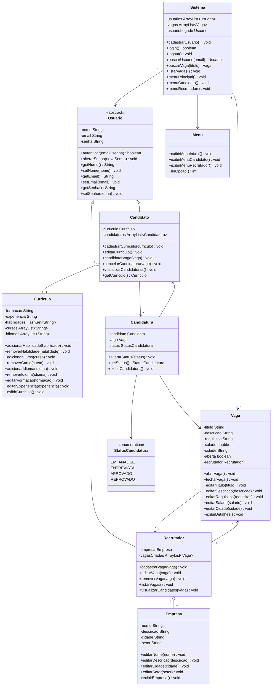

# Diagrama de classes — Sistema de vagas de emprego

Este diagrama descreve a modelagem de classes do sistema: usuários (candidatos e
recrutadores), currículos, vagas, candidaturas e o núcleo do sistema.

> Renderizado automaticamente em plataformas com suporte a Mermaid
> (GitHub, GitLab, Azure DevOps, Notion, Obsidian, VS Code com extensão Mermaid).
> Para editar/visualizar avulso, use https://mermaid.live e cole o bloco abaixo.

